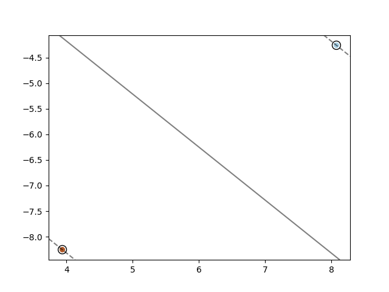
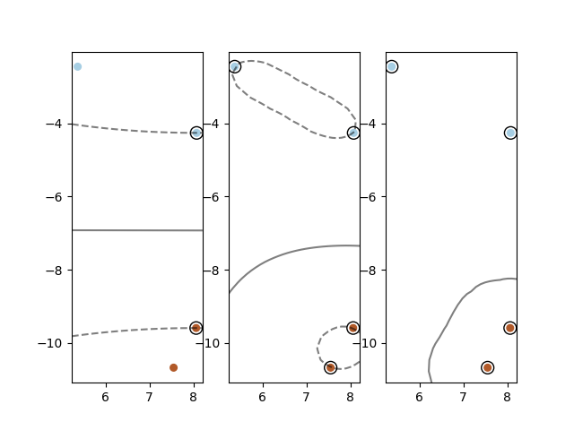

# Support Vector Machines
In this assignment we will be using support vector machines to separate data points in a binary classification setup. We will be using the breast cancer dataset later on in the assignment.

**About the Breast Cancer Dataset**:
The dataset contains 569 samples. Each feature vector is 30-dimensional and each target label is either 0 (meaning benign) or 1 (meaning malignant). Each point has the following features (read left to right, top to bottom):

|||||||
| --- | --- | --- | --- | --- | --- |
| radius_mean | texture_mean | perimeter_mean | area_mean | smoothness_mean | compactness_mean |
| concavity_mean | concave points_mean | symmetry_mean | fractal_dimension_mean | radius_se | texture_se
| perimeter_se | area_se | smoothness_se | compactness_se | concavity_se | concave points_se |
| symmetry_se | fractal_dimension_se | radius_worst | texture_worst | perimeter_worst | area_worst |
| smoothness_worst | compactness_worst | concavity_worst | concave points_worst | symmetry_worst | fractal_dimension_worst |

A single data point might have the following feature vector:

`[17.99, 10.38, 122.8, 1001, 0.1184, 0.2776, 0.3001, 0.1471, 0.2419, 0.07871, 1.095, 0.9053, 8.589, 153.4, 0.006399, 0.04904, 0.05373, 0.01587, 0.03003, 0.006193, 25.38, 17.33, 184.6, 2019, 0.1622, 0.6656, 0.7119, 0.2654, 0.4601, 0.1189]`

which corresponds tha malignant diagnosis (the target is `0`).


## Section 1
We start by exploring the effect of using different kernels using a simple dataset. Next we look at how we train maximum margin classifiers using either hard or soft margins and then we apply support vector machines on a larger data set.

### Section 1.1
Lets draw the decision boundary and margins of linear kernel support vector machine (SVM) of some data.

*You can use _plot_linear_kernel() for this*

1. generate some data with [`sklearn.datasets.make_blobs`](https://scikit-learn.org/stable/modules/generated/sklearn.datasets.make_blobs.html). Make your blobs consist of 40 samples and 2 centers.
    ```
    X, t = make_blobs(...)
    ```
2. Create an instance of [`sklearn.svm.SVC`](https://scikit-learn.org/stable/modules/generated/sklearn.svm.SVC.html) and select `linear` as the kernel type. Choose the regularization parameter `C=1000` to avoid regularization.
    ```
    clf = scm.SVC(...)
    ```
3. Plot the boundary using `tools.plot_svm_margin`.
    ```
    plot_svm_margin(...)
    ```
Turn in your plot as `1_1_1.png` in the PDF document.

For a very boring example of only two points, this plot looks like this:




### Section 1.2
*This question should be answered in your PDF document*

1. How many support vectors are there for each class in your example?
2. What is the shape of the decision boundary?

### Section 1.3
Implement a support vector machine with a radial basis function (`rbf`) using scikit learn and plot the outcome using the function `plot_svm_margin`. Use a very high value of `C` as before.

You should plot three different figures using `plt.subplot` as we did for example in [Assignment 00](../00_introduction/README.md).

*You can use _compare_gamma() for this*

These three plots will be used to compare the results you get for different values of the `gamma` parameter. Compare:
1. Default value of `gamma`
2. Low value `gamma = 0.2`
3. High value `gamma = 2`

You will again use the `sklearn.svm.SVC` and the same data blobs as before.

To achieve this plot you can slightly tweak the `tool.plot_svm_margin` as you desire.

For the very boring case of only 4 data points you should get results similar to the following



Present your plot as `1_3_1.png` in your PDF document.

### Section 1.4
*This question should be answered in your PDF documnet*

1. How many support vectors are there for each class for each value of `gamma`?
2. What is the shape of the decision boundary for each value of `gamma`?
3. What difference does the `gamma` parameter make and why?


### Section 1.5
Now using a linear basis function again as the kernel, compare different values of `C`: 1000, 0.5, 0.3, 0.05, 0.0001

Again turn in a single plot with all those cases using `plt.subplot`. You can use `_compare_C` for this.

For the very boring case of 4 points the plots should look something like this


Turn in your plot as `1_5_1.png` in your PDF document.

### Section 1.6
*This question should be answered in your PDF document*

1. How many support vectors are there for each class for each case of `C`?
2. How many of those support vectors are within the margins?.
3. Are any support vectors misclassified? If so, why?


## Section 2
Lets try applying SVMs to larger datasets We will apply SVMs to the breast cancer dataset. You can access the dataset via:

```
(X_train, t_train), (X_test, t_test) = tools.load_cancer()
```

Apply an SVM with a linear kernel and a sigmoidal kernel and calculate the accuracy, precision and recall for each classifier that you design and implement.

### Section 2.1
Create a function `train_test_SVM(svc, X_train, t_train, X_test, t_test)` that trains the SVM (svc) on `[X_train, t_train]` and returns the accuracy, precision and recall on the test set `[X_test, t_test]`.

If we have a prediction `y` and the targets `t_test`, we can use the functions `accuracy_score(t_test, y)`, `precision_score(t_test, y)` and `recall_score(t_test, y)`.

Example inputs and outputs:
```
(X_train, t_train), (X_test, t_test) = load_cancer()
svc = svm.SVC(C=1000)

train_test_SVM(svc, X_train, t_train, X_test, t_test)
```
Output:
```
(0.9181286549707602, 0.9801980198019802, 0.8918918918918919)
```

### Section 2.2
*This question should be answered in your PDF document*

Compare the results of your `train_test_SVM` function between linear, radial basis and polynomial kernel functions.

Which method seems to be the best for the task?


## Independent section
This is an open ended independent question. You can choose to compare visually different parameters on the cancer dataset, different types of models, create your own data, etc.